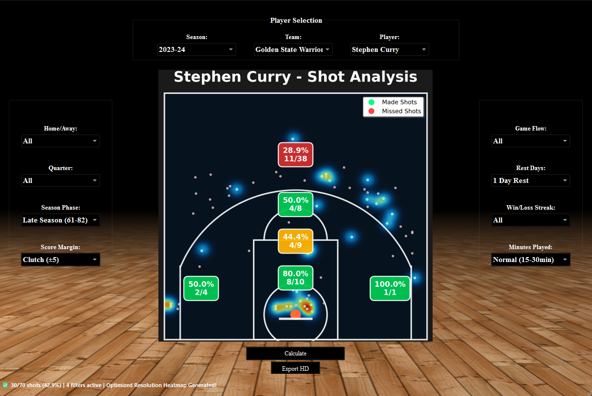

# 🏀 NBA Shot Analyzer

An interactive **desktop application** for advanced **NBA shot analysis and visualization**, developed in **Python (PyQt6)**.  
It combines official NBA datasets with a custom-built GUI and filtering system to deliver professional-grade insights into player shooting performance.

---

## 📸 Screenshot


---

## 🚀 Features
- **Interactive GUI (PyQt6):**
  - Dropdown filters for Season, Team, Player, and advanced game context.
  - Clean basketball-court background interface.

- **Data Management:**
  - Loads data from [`nba_api`](https://github.com/swar/nba_api) and local CSV datasets.
  - Supports EXE builds with safe path handling.
  - Team/Player mapping (abbreviations ↔ full names).

- **Advanced Filtering (8+ dimensions):**
  - Home/Away games
  - Quarter
  - Season phase (early/mid/late, playoffs vs regular season)
  - Score margin (clutch/competitive situations)
  - Rest days
  - Minutes played
  - Win/Loss streaks
  - Back-to-back games

- **Visualization:**
  - Custom **NBA half-court heatmap** with high-resolution rendering.
  - **14 NBA shot zones** with FG%, attempts, and made shots.
  - Crisp matplotlib visualizations optimized for GUI frame size.
  - Zone labels with dynamic coloring based on shooting efficiency.

---

## Project Structure
```bash
NBA_Shot_Analyzer/
│── mainwindow.py         # PyQt6 UI – Main application window
│── nba_data_manager.py   # Data management (NBA API + CSV datasets + team/player mapping)
│── nba_filter_engine.py  # Advanced filtering engine (home/away, rest days, streaks, etc.)
│── nba_shot_analyzer.py  # Core analytics + heatmap + zone calculator + court drawing
│── Background_image.jpg  # Court background image
│── Screenshot 2025-08-20 152037.png  # Demo screenshot
│── requirements.txt      # Python dependencies

Tech Stack

Python 3.10+

PyQt6 – Graphical User Interface

nba_api – NBA stats API

matplotlib – Heatmaps & court visualization

pandas, numpy – Data manipulation

scipy – Data smoothing for heatmaps

Installation

Clone the repository:

git clone https://github.com/ManoSegr/NBA_Shot_Analyzer.git
cd NBA_Shot_Analyzer


Install dependencies:

pip install -r requirements.txt

## 🗂 Demo Dataset
A lightweight demo dataset is included for immediate testing:

- `nba_data/datasets/shotdetail_2023_Stephen.csv` → Stephen Curry shots (2023 season)

This allows the app to run directly without downloading the full NBA datasets.


Run the app:

python nba_shot_analyzer.py


Roadmap

✅ PyQt6 GUI with dropdown filters

✅ Zone-based visualization (FG%, attempts, made/missed)

✅ Integration with nba_api + offline CSV datasets

🔄 Machine Learning: Logistic Regression model for expected FG% per zone

🔄 Expanded fatigue/matchup-based filters

🔄 Expansion into football analytics (soccer)

🔄 AI-driven "Virtual Coach" insights

Developed by Emmanouil Segredakis
Contact: manos.seg@gmail.com
